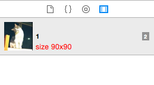

# XcodeMediaLibraryTweak
Let the Xcode Media Library more useful

<font color=red size=6>**Show image size**</font> for image type media. Size is shown as @1x scale. USE IT IN CODE WITHOUT THINKING!!!




# Installation
1. Clone this repository.
2. Open and run the project.
3. Restart Xcode.

# Xcode Version
This plug-in is ONLY test in Xcode 6.3.1. If the plugin does not work, perhaps I miss the UUID of your Xcode version.

Get you xcode UUID
```
defaults read /Applications/Xcode.app/Contents/Info DVTPlugInCompatibilityUUID
```

Copy the output and add it to XcodeMediaLibraryTweak's info.plist DVTPlugInCompatibilityUUIDs Key. Then Try run and restart Xcode.

#THANKS

* [Xcode 4 插件制作入门](http://www.onevcat.com/2013/02/xcode-plugin/)
* [Creating an Xcode Plugin: A Quick-Start Guide](http://www.overacker.me/blog/2015/01/25/creating-an-xcode-plugin)。这里有提到下面的DTXcodeUtils
* [DTXcodeUtils](https://github.com/thurn/DTXcodeUtils), 一个快速上手的xcodePlugin模版，省去配置项目的烦恼
* [DBSmartPanels](https://github.com/chaingarden/DBSmartPanels)。我是学习了这个代码写的XcodeMediaLibraryTweak

## TODO
1. 大小字体用颜色区分